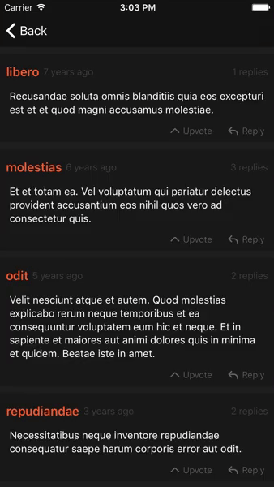
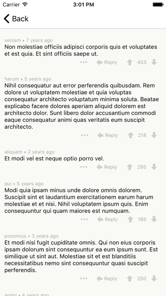
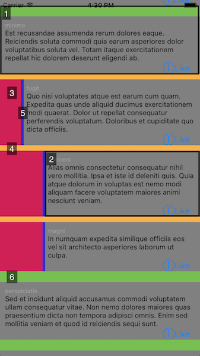

# SwiftyComments


UITableView based component designed to display a hierarchy of expandable/foldable comments.





## Installation

### Manually

Just copy the `.swift` files from the [`SwiftyComments/Classes`](SwiftyComments/Classes) folder in your project.

### Cocoapod

Add the following line to your Podfile:


```ruby
pod 'SwiftyComments', :git => 'https://github.com/tsucres/HeaderedTabScrollView.git'
```

## Usage

### Overview

Basically, all you have to do is 

1. define a view for your comments (typically, a view containing the poster's name, a datetime, the content of the comment, ...). This view will be the main subview of each `CommentCell` (subclass of `UITableViewCell`);
2. customise the apparence of the tableView through the available properties of the `CommentCell` class;
3. feed your models to the `CommentsViewController `.


### Details

Here are more details about the previous steps: 

##### 1) Build your CommentCell

A `CommentCell` is basically 1 UIView showing your comment + an indentation. Here's a basic implementation: 

```swift
class YourCommentCell: CommentCell {
    
    override init(style: UITableViewCellStyle, reuseIdentifier: String?) {
		super.init(style: style, reuseIdentifier: reuseIdentifier)
		
		// YourCommentView is a UIView aimed to contain all the info about a comment (poster's name, date, body, ...)
		self.commentViewContent = YourCommentView()
    	
    	// Customisation...
		// ...
	}
	required init?(coder aDecoder: NSCoder) {
		fatalError("init(coder:) has not been implemented")
	}
}

```

##### 2) Customise your cell

The suroundings of your comment view (such as the indentation, the margins) are customisable through several properties of the `CommentCell` class : 

```swift
	
	// Margin on top of a root comment
	self.rootCommentMarginColor = ...
	self.rootCommentMargin = ...
	// Margin on top of any non-root comment
	self.commentMarginColor = ...
	self.commentMargin = ...
	// Space on the left of any indented comment
	self.identationColor = ...
	// Vertical line between the indentation space and the comment
	self.indentationIndicatorColor = ...
	self.indentationIndicatorThickness = ...
	// Whether to continue the indentyation indicator on all the child comments or not
	self.extendIndentationIndicators = ...
	// thickness of the indentation offset per level
	self.indentationUnit = ...

```


##### 3) Load the data

The `CommentsViewController` class inherits from `UITableViewController` and takes care of loading your cells. All you have to do is fill the `allComments` property with your models and override the `tableView(_:cellForRowAt:)` method: 


```swift

class YourCommentsViewController: CommentsViewController {
	private let commentCellId = "commentCellId"
	var allComments: [YourCommentModel] = [] // All the comments (nested, not in a linear format)
	
	override func viewDidLoad() {
		super.viewDidLoad()
		
		tableView.register(SimpleCommentCell.self, forCellReuseIdentifier: commentCellId)
		currentlyDisplayed = allComments // Assuming your models are loaded in allComments
    }
    
	override func tableView(_ tableView: UITableView, cellForRowAt indexPath: IndexPath) -> CommentCell {
		let commentCell = tableView.dequeueReusableCell(withIdentifier: commentCellId, for: indexPath) as! YourCommentCell
		let comment = currentlyDisplayed[indexPath.row] as! YourCommentModel
		commentCell.level = comment.level
		// commentCell.body = ...
		return commentCell
    }
}

```

**Note** that your model must satisfy the `AbstractComment` protocol: 

```swift
public protocol AbstractComment: class {
    var replies: [AbstractComment]! { get set }
    var level: Int! { get set }
    weak var replyTo: AbstractComment? { get set }
}
```

By default, when a comment is expanded, the tableView will scroll to make the replies visible. You can turn this feature off throught the property `makeExpandedCellsVisible`.

### Overall structure of the tableview

The following image shows the structure of the tableView:



- **`1`** shows the whole `CommentCell`
- **`2`** is the `UIView` assigned to the `commentViewContent` property of the cell
- **`3`** is the *indentation* space, which you can personalise through the `indentationUnit`and `identationColor` properties of the `CommentCell`
- The color and the thickness of **`4`** are personalisable through the properties `commentMarginColor` and `commentMargin` of the `CommentCell`
- **`5`** is similarly modifiable through `indentationIndicatorColor` and `indentationIndicatorThickness`
- same for **`6`** with `rootCommentMarginColor` and `rootCommentMargin`


### AttributedStrings

You can easily add special styles (titles, links, paragraph spacing, bold/italic font for some words, ..) in your commentContentView using a `UITextView` with a `NSAttributedString`. 

Though, if your comment contents are in html format you may want to reconsider your eventual plan of using the  `DocumentReadingOptionKey.documentType: NSAttributedString.DocumentType.html` option. Even if this way is really simple and straightforward, it's not efficient and takes a long time (.15 - .2 s in my experience) to load the string. Since the height of the cells are automatically calculated based on their content, that delay leads to glitches/lagging.


An alternative (illustrated in the `HNCommentsViewController` example) is to parse the html yourself and build the NSAttributedString by adding the attributes "manually". 

This may be more difficult to implement depending on how complex the format of your comments are, but it's waaaay more efficient.

If you don't trust me, go in the [`HNCommentsViewController.swift`](Example/SwiftyComments/HNCommentsViewController.swift) and uncomment the part that loads the comments the easy way...

The example makes use of [SwiftScanner](https://github.com/malcommac/SwiftScanner) to parse the html of the hackernews comments. Check the [`HNCommentContentParser.swift`](Example/SwiftyComments/HNCommentContentParser.swift) file for more details on how the AttributedStrings are built.

## Example

To run the example project, clone the repo, and run `pod install` from the Example directory.

There are four different implementations of the `CommentsViewController ` in this project: 

- `SimpleCommentsViewController` illustrates a basic implementation;
- `ImgurCommentsViewController` is a clone of the commenting system on the iOS app of Imgur;
- `RedditCommentsViewController` is a clone of the commenting system on the iOS app of Reddit;
- `HNCommentsViewController` illustrates the use of AttributedStrings.


## TODO

- option to fully expand by default
- More abstraction on top of the tableview: 
	- getting rid of the `init(style: UITableViewCellStyle, reuseIdentifier: String?)`
	- override the `func tableView(_ tableView: UITableView, cellForRowAt indexPath: IndexPath) -> CommentCell`
- The add/delete rows in iOS 11 is a bit weird.. any solution?

## License

SwiftyComments is available under the MIT license. See the LICENSE file for more info.
